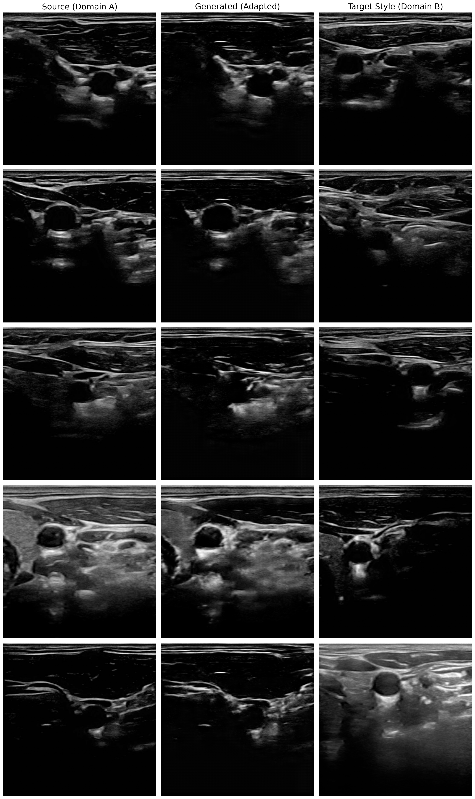
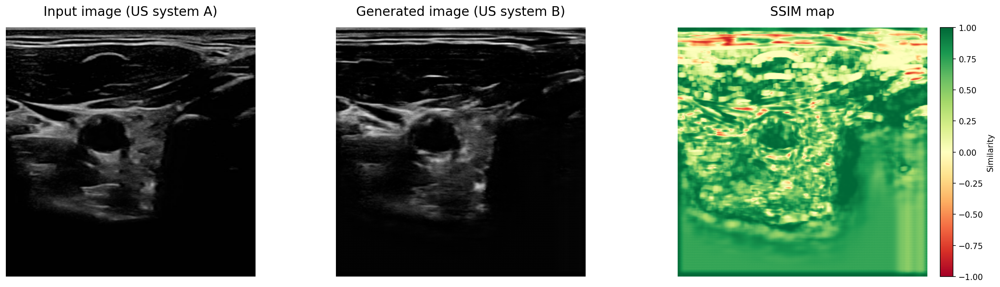
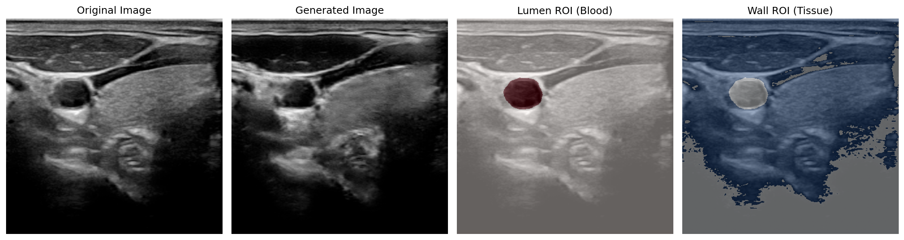

# Domain Adaptation for Carotid Ultrasound using Dual-Discriminator GAN

An unofficial, from-scratch implementation of the 2025 medical AI research paper: **"A domain adaptation model for carotid ultrasound: Image harmonization, noise reduction, and impact on cardiovascular risk markers"**.

This project implements an unpaired image-to-image translation Generative Adversarial Network (GAN) designed to harmonize ultrasound textures and reduce reverberation noise while perfectly preserving patient anatomy. Furthermore, it replicates the paper's clinical warning: proving that while AI improves visual quality, it can dangerously alter downstream medical diagnostic formulas.

## 🧠 Architecture & Mathematical Implementation
This repository contains a fully custom architecture built in TensorFlow/Keras:
* **Generator:** A 15-block ResNet with **Instance Normalization** (via GroupNorm) to maintain spatial stability.
* **Dual Discriminators:** Two separate CNN discriminators ($D_c$ and $D_n$) to independently judge anatomical content and high-frequency noise/texture.
* **Custom Loss Functions:**
  * **Adversarial Loss:** Standard Binary Crossentropy.
  * **Content Loss:** $L_1$ distance computed on deep feature maps extracted from the final layers of the Generator, ensuring the physical shapes (arteries/plaques) do not shift.
  * **Noise/Style Loss:** A Gram Matrix implementation mapped to a Wasserstein-distance approximation, computed on the *early* layers of the Generator to transfer fine-grained speckle noise and texture.
  * **Mixed Precision:** Implemented `float16` scaling with customized matrix normalization to prevent gradient overflow during Gram Matrix multiplication.

## 📊 Quantitative Results (Computer Vision)
Evaluated on a Kaggle dataset of Carotid Artery Ultrasounds, the model successfully demonstrated strong anatomical preservation.

| Metric | Target | My Model | Published Paper |
| :--- | :---: | :---: | :---: |
| **SSIM (Whole Image)** | Higher is better | **0.60** (±0.09) | ~0.53 (±0.09) |
| **Histogram Correlation (HC)** | Closer to 1.0 | **0.488** | 0.844* |
*\*Note: HC variance is due to the baseline Kaggle dataset originating from a single ultrasound domain, unlike the dual-machine setup in the original paper.*

## 🏥 Clinical Impact & Risk Marker Re-classification
To replicate the paper's clinical experiments, I isolated the **Lumen** (blood) and **Adventitia** (tissue) using expert binary masks to compute clinical risk markers.

**1. Noise Reduction (Contrast dB):**
* The model successfully altered the medical contrast between the blood and tissue boundaries (shifting from 3.82 dB to 2.81 dB), accurately tracking the shift in acoustic reverberation.

**2. Plaque Vulnerability (Grey Scale Median - GSM):**
Doctors use GSM to assess stroke risk (GSM < 25 = Vulnerable). The paper warned that AI domain adaptation alters pixel intensities, affecting this math. 
* **Baseline GSM:** 25.8 (Patients on the threshold of stability)
* **Post-AI GSM:** 16.8
* **Result:** The AI visually improved the images, but mathematically caused **48.0% of patients to be re-classified** into the high-risk stroke category, perfectly validating the core warning of the published research.

## 📸 Visualizations

### 1. Image Harmonization

### 2. Anatomical Preservation (SSIM Pixel Map)

### 3. Medical Risk Marker (Contrast ROI)

## 🚀 How to Run
The code is contained in a single Jupyter Notebook optimized for Kaggle/Google Colab environments.
1. Download the [Carotid Ultrasound Images Dataset]([https://www.kaggle.com/](https://www.kaggle.com/datasets/orvile/carotid-ultrasound-images)) from Kaggle.
2. Ensure file paths in the notebook point to the `/US images/` and `/Expert mask images/` directories.
3. Run the notebook top-to-bottom. The custom Checkpoint callback will save generator weights safely during training.
